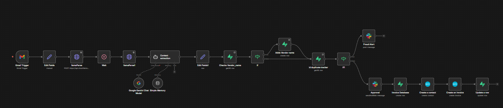
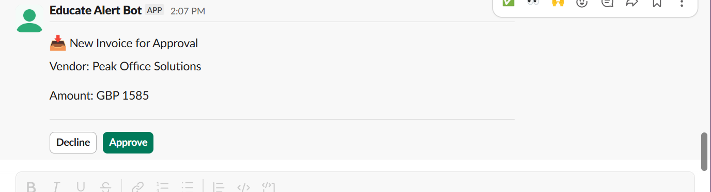
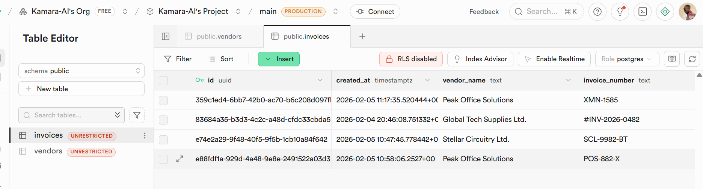
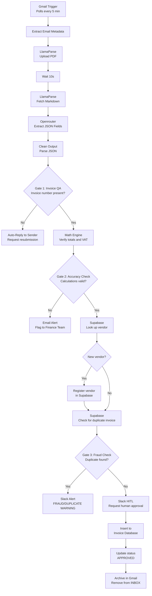
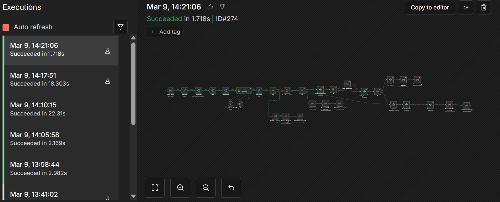

# Enterprise Invoice Automation & Security Suite



An n8n workflow that autonomously processes incoming invoices from Gmail — extracting data with AI, validating integrity through a triple-check audit system, detecting fraud, and requiring human approval before writing to the database.

Built as a production-ready, client-deployable system.

---

## Screenshots

**Slack HITL Approval — invoice paused until a human clicks Approve**


**Supabase Invoice Ledger — real vendor data written after approval**


---

## The Problem It Solves

| Manual Problem | Automated Solution | Business Impact |
|---|---|---|
| Staff spend hours typing PDF data into systems | LlamaParse + Openrouter converts PDFs to structured JSON | Processing time: hours → seconds |
| Blurry or incomplete invoices stall the process | Gate 1 auto-detects unreadable files and requests resubmission | 100% data integrity before touching financial records |
| Human error in tax and total calculations | Dedicated math engine re-calculates subtotals and VAT | Eliminates overpayment and audit failures |
| Duplicate invoices and fraud go undetected | Every invoice number cross-referenced against Supabase ledger | 24/7 fraud detection with instant Slack alerts |
| Fully automated systems feel risky without oversight | Human-in-the-loop Slack approval before any database write | Executive control retained over fund disbursement |

---

## Architecture



---

## Features

### Triple-Check Audit System

**Gate 1 — Quality Check**
Inspects the extracted JSON for a valid `invoice_number`. If missing or null, the workflow automatically replies to the sender with a formatted HTML email requesting a clean resubmission — no human involvement needed.

**Gate 2 — Math Engine**
Custom JavaScript re-calculates:
- Expected total: `subtotal + tax`
- Expected VAT: `subtotal × 0.20` (configurable rate)

Flags mismatches within a £0.05 tolerance and sends an alert to the finance team email. The invoice is paused until corrected.

**Gate 3 — Fraud & Duplicate Detection**
Cross-references the extracted `invoice_number` and vendor against the Supabase master ledger. Fires an immediate Slack alert on any duplicate — acting as a 24/7 financial sentry.

### Human-in-the-Loop (HITL)
Uses n8n's `sendAndWait` Slack node. The workflow pauses and will not write to the database until a designated approver clicks **Approve** in Slack. No invoice is committed without a human decision.

### Vendor Registry
Automatically registers new vendors in a Supabase `vendors` table on first invoice receipt. Subsequent invoices from the same vendor skip registration and go straight to duplicate checking.

### Gmail Lifecycle Management
Each invoice exits with the correct Gmail label regardless of outcome:
- Failed QA → labelled and archived
- Math error → labelled and archived
- Fraud detected → labelled and archived
- Approved → labelled and archived

Your inbox stays clean automatically.

### Error Resilience
Every node has `retryOnFail: true`. A separate error-monitoring workflow (`errorWorkflow`) catches any execution failure and notifies the developer with a direct execution link — no silent failures.

---

## Tech Stack

| Layer | Tool |
|---|---|
| Workflow orchestration | n8n |
| PDF parsing | LlamaIndex LlamaParse API |
| AI extraction | Google Gemini (via n8n LangChain nodes) |
| Database | Supabase (PostgreSQL) |
| Notifications & HITL | Slack |
| Email trigger & management | Gmail API |
| Math validation | n8n Code node (JavaScript) |

---

## Prerequisites

- n8n instance (cloud or self-hosted)
- LlamaIndex Cloud account (LlamaParse API key)
- Google Gemini API key
- Supabase project
- Slack workspace with a dedicated channel
- Gmail account connected via OAuth2

---

## Supabase Schema

Create two tables in your Supabase project before importing the workflow.

**`vendors` table**
```sql
create table vendors (
  id uuid default gen_random_uuid() primary key,
  name text not null,
  created_at timestamptz default now()
);
```

**`invoices` table**
```sql
create table invoices (
  id uuid default gen_random_uuid() primary key,
  invoice_number text,
  total_amount numeric,
  currency text,
  vendor_name text,
  tax_amount numeric,
  raw_ai_output jsonb,
  status text default 'PENDING',
  created_at timestamptz default now()
);
```

---

## Setup

1. **Import the workflow**
   - In n8n, go to **Workflows → Import from file**
   - Select `workflow/invoice_automation.json`

2. **Configure credentials**
   - `Gmail OAuth2` — connect your Gmail account
   - `Google Gemini (PaLM) API` — add your Gemini API key
   - `Supabase API` — add your project URL and service role key
   - `LlamaParse Header Auth` — add `Authorization: Bearer YOUR_LLAMAPARSE_KEY`
   - `Slack API` — add your Slack bot token

3. **Update workflow variables**
   - Slack channel ID → your approval channel
   - Finance team email → your error alert recipient
   - Gmail label ID → create a label in Gmail and paste its ID (found via Gmail API or Settings)

4. **Deploy error workflow**
   - Create a separate n8n workflow to handle errors
   - Set its ID in the workflow settings under `errorWorkflow`

5. **Activate the workflow**

---

## Customization

| Parameter | Default | How to change |
|---|---|---|
| Polling interval | Every 5 minutes | Gmail Trigger node → `pollTimes` |
| VAT rate | 20% | Calculator node → `net * 0.20` |
| Email filter | subject contains "invoice" or "bill" | Gmail Trigger → `filters.q` |
| Database | Supabase | Replace Supabase nodes with your preferred DB |
| Approval channel | Single Slack channel | Route vendors to different channels via IF nodes |

---

## Project Status

Production-ready. Built and tested with live invoice data. Execution logs confirm successful end-to-end runs across all branches including fraud detection and HITL approval paths.



---

## Author

**Brian Kamara Otang'o**
AI Automation Engineer — [LinkedIn](https://www.linkedin.com/in/brian-kamara) · [GitHub](https://github.com/Kamara-AI)
